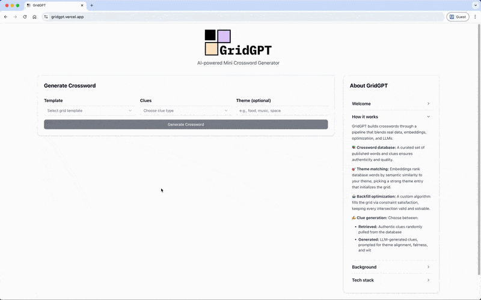

# GridGPT

🚀 **Live App:** https://gridgpt.vercel.app/ 

A smart mini crossword generator powered by GPT that creates themed crossword puzzles with AI-generated clues. GridGPT combines intelligent word placement algorithms with natural language processing to generate engaging crossword puzzles.

<p align="center">
  <a href="https://gridgpt.vercel.app/ ">
    
  </a>
</p>


## Table of contents

- [Features](#features)
- [Architecture](#architecture)
- [Quick start](#quick-start)
- [Word database setup](#word-database-setup)
- [Backend architecture](#backend-architecture)
- [Frontend architecture](#frontend-architecture)
- [Development](#development)
- [About](#about)

## Features

- 🧩 **Smart grid generation**: Creates crossword grids using various templates and patterns
- 🎯 **Theme-based puzzles**: Generates crosswords around specific themes, with several LLM-vetted on-theme entries per grid and a different puzzle each run
- 🤖 **AI-powered clues**: Uses GPT to create creative and contextual clues
- 🎨 **Visual interface**: Modern React frontend with interactive grid previews
- 📊 **Word database**: Comprehensive database with frequency analysis and filtering

## Architecture

The project consists of three main components:

### Backend (Python/FastAPI)
- **Core engine**: Word placement optimization algorithm and grid generation
- **AI integration**: OpenAI GPT integration for clue generation
- **Database management**: Word database with filtering and frequency analysis
- **API server**: FastAPI endpoints for crossword generation

### Frontend (Next.js/React)
- **Modern UI**: Clean interface built with Next.js and Tailwind CSS
- **Interactive components**: Customization components and visual grid previews and checks
- **Real-time generation**: Live crossword creation with theme selection

### Data Pipeline
- **Web scraping**: Automated collection of crossword data
- **Data processing**: Word frequency analysis and clue filtering
- **Template management**: Grid pattern definitions and configurations

## Quick start

### Prerequisites
- Python 3.10+
- Node.js 18+
- OpenAI API key

### Installation

1. **Clone the repository**
   ```bash
   git clone https://github.com/mariecordes/gridgpt.git
   cd gridgpt
   ```

2. **Set up the backend**
   ```bash
   # Create and activate a virtual environment
   python -m venv venv
   source venv/bin/activate  # On Windows: venv\Scripts\activate
   
   # Install the package in editable mode with all dependencies
   pip install -e .
   ```

3. **Configure environment**
   ```bash
   cp .env.sample .env
   # Edit .env and add your OPENAI_API_KEY (from platform.openai.com or proxy)
   # Optional: set OPENAI_DEFAULT_MODEL / OPENAI_CLUE_MODEL if you want overrides
   source .env
   ```

4. **Set up the frontend**
   ```bash
   cd frontend
   npm install
   ```

### Running the Application

1. **Start the backend API** (development)
   ```bash
   python run_api.py  # or: uvicorn api.main:app --reload
   ```

2. **Start the frontend** (in a new terminal)
   ```bash
   cd frontend
   npm run dev
   ```

3. **Access the application**
   - Frontend: http://localhost:3000
   - API: http://localhost:8000
   - API Documentation: http://localhost:8000/docs

## Word database setup

GridGPT uses a word database built from online crossword sources. Follow these steps to create and maintain the database:

### 1. Scrape source data

**Scrape NYT's Mini Crosswords from [`worddb.com`](https://worddb.com)**
```bash
python scripts/scrape_worddb.py --start-date 2023-01-01 --end-date 2023-12-31
```
This creates and updates: `data/01_raw/worddb_com/nyt_mini_clues.json`


### 2. Process raw data

**Create the main word database**
```bash
python scripts/create_worddb_database.py
```
This processes the scraped data and creates: `data/02_intermediary/word_database/word_database_full.json`


### 3. Automatic filtering

Then whenever `WordDatabaseManager()` is initialized in the backend, it automatically creates up to date filtered databases relevant for the crossword to be generated:
- `data/02_intermediary/word_database/word_database_filtered.json` - Filtered word-clue pairs
- `data/02_intermediary/word_database/word_list_with_frequencies.json` - Word frequency analysis

The filtering process can flexibly:
- limit for minimum and maximum number of characters in a word
- apply a minimum frequency threshold (e.g., words must have been used in a crossword more than 5 times)
- exclude special characters
- remove reference clues (e.g., "See 15-Across")

### 4. All in one command: Keeping the DB up to date

Instead of running the scrape, build, and embedding steps by hand, use:
```bash
make refresh-db                    # scrape new dates, rebuild the DB, refresh embeddings
make refresh-db ARGS="--dry-run"   # show what it would do, change nothing
make refresh-db ARGS="--force"     # rebuild word list + embeddings even with no new data
```
It detects the gap between the newest scraped NYT mini date and today, scrapes only the missing days (merged into `nyt_mini_clues.json`), rebuilds `word_database_full.json`, regenerates the filtered word list, and force-rebuilds the embedding cache so everything stays in sync. This is the only command that makes embedding API calls; running the app never re-embeds when the cache already exists.

After a refresh, **commit `word_database_full.json`** (the one tracked data file). On deploy, Railway rebuilds the filtered word list and embeddings from it, so the live site picks up the new data.

### Additional sources

*⚠️ The output of the data pipeline below is currently not in use. In the future, it is planned to integrate this data as well as extend the word database with additional sources.*

**Scrape crossword data from [`crosswordtracker.com`](http://crosswordtracker.com/)**
```bash
python scripts/scrape_crosswords_2.py letters A B C # list which letter to scrape individually
```
This creates: `data/01_raw/crossword_tracker/crossword_words_[A-Z].json`

**Create crossword tracker database**
```bash
python scripts/create_crosswordtracker_word_db.py
```


## Backend architecture

### Core components

**`CrosswordGenerator`**: Grid generator that pins theme anchors into a template and fills the remaining slots under the given constraints.
```python
from src.gridgpt.crossword_generator import generate_themed_crossword

# Draw anchors at random from a pool of vetted on-theme words, then fill around them
result = generate_themed_crossword(template_dict, theme_entries=["PIZZA", "PASTA", "CHEF"])
```

**`ThemeManager`**: Scores every database word against the theme (embedding similarity) and shortlists candidate theme entries
```python
from src.gridgpt.theme_manager import ThemeManager

theme_manager = ThemeManager("food", db_manager)
similarities = theme_manager.score_all_words()               # {WORD: cosine}
candidates = theme_manager.get_anchor_candidates(pool_size=60)
```

**`ThemeAnchorSelector`**: LLM judge that vets those candidates down to a pool of genuinely on-theme words, filtering out loose matches that similarity alone lets through. Validation is two-tier: a word in the database always passes, and a word the LLM adds itself (optional, off by default) must also clear a dictionary-frequency check.
```python
from src.gridgpt.theme_anchor import ThemeAnchorSelector

pool = ThemeAnchorSelector().select_anchors("food", candidates, db_manager, max_words=30)
```
Sizes and behaviour are tunable under `theme_anchors` in `conf/base/parameters.yml` (how many candidates the LLM sees, how many it may approve, how many are pinned per grid).

**`WordDatabaseManager`**: Fundamental manager for word database operations
```python
from src.gridgpt.word_database_manager import WordDatabaseManager

db_manager = WordDatabaseManager() # with default values
db_manager = WordDatabaseManager( 
    min_frequency=5,
    min_length=3,
    max_length=5,
    exclude_special_chars=True,
    exclude_reference_clues=True
) # with customized values

# Review available database items
db_manager.word_database_filtered
db_manager.word_list_with_frequencies
```

**`ClueGenerator`**: AI-powered clue creation
```python
from src.gridgpt.clue_manager import ClueGenerator

clue_gen = ClueGenerator()
clue = clue_gen.generate_clue(word="PYTHON", theme="programming")
```

**`ClueRetriever`**: Retrieval of previously published clues
```python
from src.gridgpt.clue_manager import ClueRetriever

clue_retriever = ClueRetriever()

# Identify all listed clues for a word in the database
available_clues = clue_retriever.get_available_clues(word="PYTHON")

# Randomly select a single clue from the database
available_clues = clue_retriever.retrieve_clue(word="PYTHON")
```

**`TemplateManager`**: Grid template management
```python
from src.gridgpt.template_manager import select_template

template = select_template(template_id="5x5_diagonal_cut")
```

### API endpoints

- `GET /api/templates` - List available grid templates
- `POST /api/generate-crossword` - Generate a complete crossword puzzle
- `POST /api/check-solution` - Check solution against correct answers
- `GET /api/test` - Verify endpoint is working
- `GET /health` - API health check

## Frontend architecture

### Key components

Main interface component **`CrosswordGenerator`**:
- Template selection with visual preview icons
- Clue type selection (generated vs. retrieved, mandatory)
- Theme input (optional)
- Output crossword grid with interactive fill and solution checks
- Generated/retrieved clue panel


## Development

### Environment variables

| Variable | Required | Purpose |
|----------|----------|---------|
| `OPENAI_API_KEY` | Yes | Auth for embeddings & clue generation |
| `OPENAI_DEFAULT_MODEL` | No | Base chat/LLM model (default: `gpt-4o-mini`) |
| `OPENAI_CLUE_MODEL` | No | Alternate model specifically for clue generation |
| `OPENAI_BASE_URL` | No | Custom proxy / self-hosted gateway base URL |
| `BACKEND_URL` | No | Server-side target used by Next.js internal proxy route (`/api/crossword`) |
| `ALLOW_ALL_CORS` | No | Set to `true` ONLY for quick local testing (overrides allowlist) |
| `EXTRA_CORS_ORIGINS` | No | Comma-separated extra allowed origins |

### Embeddings & caching

Embeddings (OpenAI `text-embedding-3-small`) are cached on disk and reused. They are built once and must be rebuilt whenever the word database changes, otherwise new words score as unrelated to every theme.

Cached files:
- `data/02_intermediary/word_database/word_embeddings_fp16.npy`
- `data/02_intermediary/word_database/word_index.json`

Generation requests only embed the theme phrase; similarity is computed over the cached matrix. Running the app never rebuilds the cache when it already exists, so startup makes no embedding calls.

#### Precompute (optional but recommended for deploy)
```bash
python -m scripts.precompute_embeddings --verbose
# or
make precompute
```
`make precompute` is build-if-missing: it does nothing if the cache is already present. To refresh a cache after a database change, run `make refresh-db` (recommended) or `python -m scripts.precompute_embeddings --force`.

### Makefile shortcuts
```bash
make develop         # install deps + editable package
make precompute      # build embeddings cache (if missing)
make refresh-db      # scrape new data, rebuild DB + embeddings
make build-backend   # deps + embeddings (deploy helper)
make dev-backend     # uvicorn with reload
make dev-frontend    # Next.js dev
make clean           # remove embedding artifacts
make clean-and-build-backend  # clean then rebuild
```

### Deployment

- **Backend:** Railway (FastAPI). Build command `make build-backend` and start command `uvicorn api.main:app --host 0.0.0.0 --port $PORT`.
- **Frontend:** Vercel. Client calls go to `/api/crossword` (server-side proxy using `BACKEND_URL`).
- **CORS:** Restricted allowlist (localhost + production domain). Expand via `EXTRA_CORS_ORIGINS` or temporarily with `ALLOW_ALL_CORS=true`.
- **Embeddings:** Precompute step eliminates first-request latency.

### Project structure
```
gridgpt/
├── src/                   # Core Python modules
├── api/                   # FastAPI application
├── frontend/              # Next.js React app
├── data/                  # Word databases and raw data
├── conf/                  # Configuration files
├── scripts/               # Data processing scripts
├── notebooks/             # Jupyter development notebooks
└── tests/                 # Test suites
```

### Adding new templates

1. **Define the template** in `data/03_templates/grid_templates.json`
2. **Add SVG pattern** to `GridPreview` component
3. **Test generation** with the new template


## Configuration

Configuration files are located in `conf/base/`:

Key configuration files:
- `parameters.yml`: Generation parameters
- `prompts.yml`: AI prompt templates
- `catalog.yml`: List of used data files

## Next steps:

Some of my ideas for future updates and enhancements are:

- Include a difficulty parameter that influences word selection and clue generation
- Expand word database sources to include a greater number of words
- Allow inclusion of words that are not listed in the word database (i.e., new entries; potentially with LLM verification)
- Expand templates to different sizes than the plain 5x5 Mini set-up, or even allow flexible user creation of a grid template
- Integrate other LLM providers

## About

Hi fellow crossword enthusiasts! I'm Marie, a data scientist based in Berlin with a huge passion for all sorts of games and riddles – especially crosswords.

There's something magical about that perfect "aha!" moment when a tricky clue finally clicks – it's similar to when you finally fix that frustrating bug that's been haunting your code for hours, or when your data pipeline runs flawlessly from start to finish.

So naturally, I thought: why not combine my love for puzzles with my passion for all things data and engineering?

That's how GridGPT was born!

### How it works

GridGPT builds crosswords through a pipeline that blends real data, embeddings, optimization, and LLMs:

📚 **Crossword database:** A curated set of published words and clues ensures authenticity and quality.

🎯 **Theme matching:** Embeddings score every database word by semantic similarity to your theme, then an LLM judges which of those a solver would genuinely recognise as on-theme (and can optionally be allowed to suggest words of its own). Several approved words are pinned into the grid as anchors, drawn at random from the approved pool so the same theme gives a different puzzle each time, while the rest of the fill is still steered toward the theme.

🤖 **Backfill optimization:** A custom algorithm fills the grid via constraint satisfaction, keeping every intersection valid and solvable.

✍️ **Clue generation:** Choose between:

- **Retrieved:** Randomly selected, authentic clues pulled from the database
- **Generated:** LLM-generated clues, prompted for theme-alignment, fairness and wit

📊 **Evaluation:** To ensure and improve game performance, the pipeline stages are carefully evaluated. See the [evaluation notes](docs/evaluation.md) for what was tested, the results, and how to reproduce them.

### Background

I built GridGPT to mix data science optimization with LLM creativity – essentially creating a completely new, unique puzzle at the click of a button.

This is a hobby project born from curiosity: what happens when you blend algorithmic thinking with AI creativity?

Now, let me be clear – this in no way substitutes the brilliant human creativity and clever wordplay that goes into creating those delightful crosswords that professional constructors make. Human-made crosswords have soul, wit, and those perfect "gotcha!" moments that only come from genuine craftsmanship.

GridGPT is more like a fun experiment in computational creativity – for those moments when you want a quick puzzle fix, you're curious about a specific theme, or just seeing what an AI thinks makes a good crossword clue.

Whether you’re new to crosswords or a seasoned solver, enjoy exploring!

### Tech stack

- **Frontend:** Next.js, React, TypeScript, Tailwind CSS
- **Backend:** Python FastAPI with OpenAI API integration (Railway hosted)
- **Data:** Scraped word database from [WordDB](https://www.worddb.com/)
- **Deploy:** Railway (backend) & Vercel (frontend)